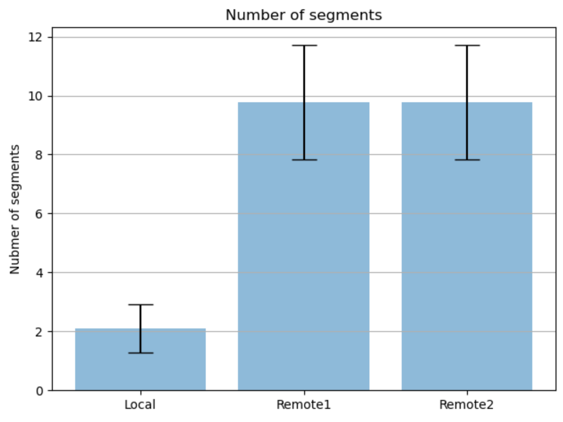

# HttpInference

HttpInference is a http android client and http server example for deep learning offloading.
   
## Android Build
1) git clone https://github.com/lovgrammer/HttpInference.git
2) import project to your Android Studio
3) build and install

## Server Install and Run
1) Install python3
2) ./install.sh
3) cd infserver
4) python3 manage.py migrate
5) python3 manage.py runserver ip:port

## How to use HttpInference:
1) Type in the remote1 and remote2 server IP "http://yourip:yourport/" (you should put / in the end of the string)
(e.g., remote1 - edge server, remote2 - cloud server)
2) Click start button
3) Then, HttpInference app execute three process for 100 images
- run segmentation inference in the local device
- send file to remote1 inference server and get result image from the server
- send file to remote2 inference server and get result image from the server
4) The measurement result of latency and segmentation results will be stored in the /sdcard/result.csv

## plot
1) adb pull /sdcard/result.csv .
2) python analysis_inftime.py
3) python analysis_segnum.py
3) python analysis_totaltime.py

## Application Image

## Plot Example

